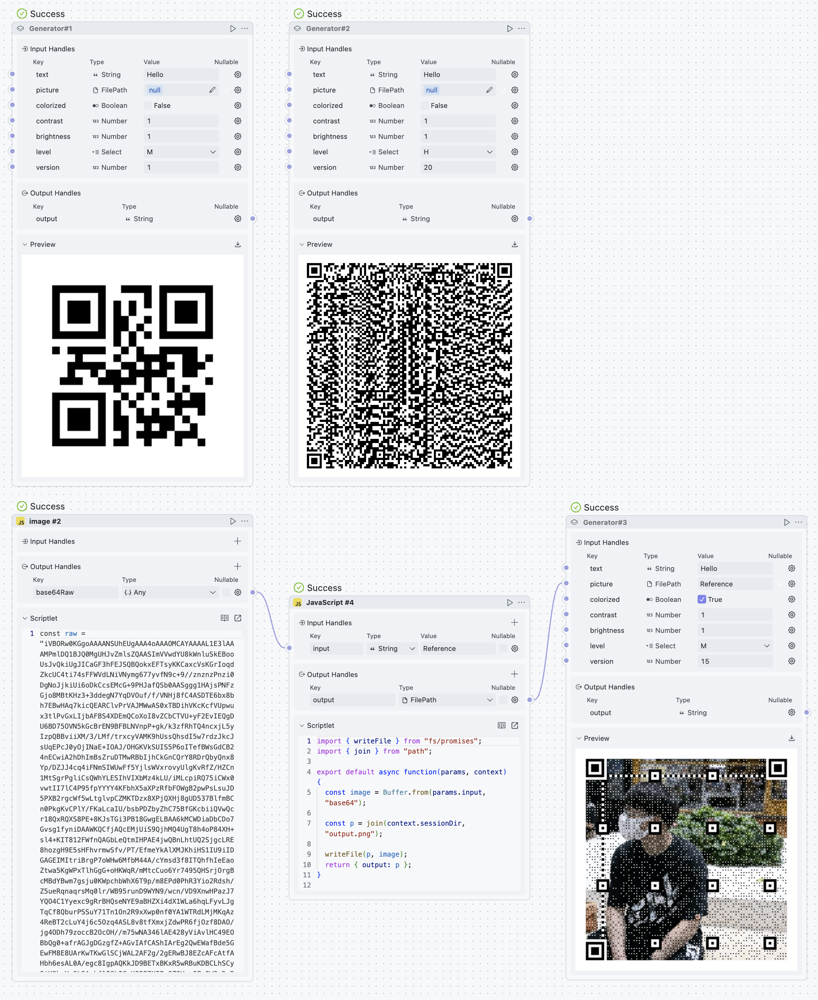

# QRCode

Use QR Code Reader/Generator in [OOMOL Studio](https://oomol.com/).

## Reader

Use: https://www.npmjs.com/package/jimp / https://github.com/cozmo/jsQR

## Generator

Ues: https://github.com/x-hw/amazing-qr

Screenshot:

